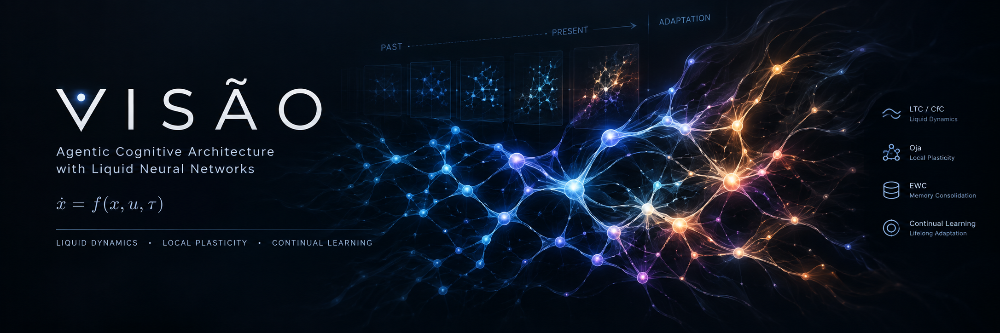

# VISÃO — Agentic Cognitive Architecture with Liquid Neural Networks



**VISÃO** is a cognitive architecture designed to operate as a personal brain — trained like modern models, but also continuously from ongoing use. Its central thesis: *"A model that learns both from batch training and from continuous experience."*

[](https://github.com/silveirinhajuan/projeto-visao)
[](https://python.org)
[](LICENSE)

---

## Architecture

VISÃO is built on **5 pillars**:

| Pillar | Module | Description |
|--------|--------|-------------|
| **Liquid** | `visao/brain.py` | Liquid Time-Constant (LTC/CfC) core with Oja + EWC + Surprise |
| **Neuro-Symbolic** | `visao/reasoning/neuro_symbolic.py` | SymbolicSolver + TextualGradient + VerificationEngine |
| **Agentic** | `visao/agent/planner.py` | Planner + Executor + Monitor |
| **Memory** | `visao/memory/hippocampus.py` | EpisodicBuffer + SemanticGraph + ProceduralMemory |
| **Continual** | `visao/continual/` | Task Boundary Detection + Meta-Learner + Task-Free |

### New Modules (2026-09-10)

| Module | Description | Tests |
|--------|-------------|-------|
| `visao/reasoning/inference.py` | InferenceEngine + KnowledgeBase | 76 |
| `visao/agent/self_reflection.py` | PerformanceTracker + SelfReflection | — |
| `visao/interpret/visualize.py` | StateVisualizer + TopologyVisualizer | — |
| `visao/interpret/causal.py` | CausalAnalyzer + OODStressTest | — |
| `visao/interpret/saliency.py` | VisualBackProp + RangeTest | — |
| `visao/memory/multi_timescale.py` | ThreeTimescaleState (τ=0.1, 1.0, 10.0) | 4 |
| `visao/continual/meta_learner.py` | MetaContinualLearner (MAML-style) | 28 |
| `visao/continual/task_boundary.py` | Task Boundary Detection + Consolidation | 7 |
| `visao/bench/scaling_laws.py` | Scaling laws experiments | — |
| `visao/bench/long_term_memory.py` | Long-term memory benchmarks | — |

---

## Quick Start

```bash
# Install
pip install -e .

# Run tests (150 passing)
python -m pytest visao/tests/ -v

# Demo: VisaoCognitiveBrain
python -c "from visao.integrate import demo_cognitive_brain; demo_cognitive_brain()"

# Demo: Task Boundary Detection
python visao/continual/task_boundary.py

# Demo: Inference Engine
python visao/reasoning/inference.py

# Demo: Visualization
python visao/interpret/visualize.py
```

---

## Philosophy

The evolution of Liquid Neural Networks:

```
Neural ODE → LTC → CfC → Liquid-S4 → LFM1 → LFM2 → LFM2.5
```

VISÃO's position: **not a giant LTC**, but a hybrid architecture where:

- **Liquid dynamics** handle continuous-time, adaptive processing
- **Symbolic reasoning** handles logic and verification
- **Agentic modules** handle planning and execution
- **Memory systems** handle long-term knowledge
- **Continual learning** enables improvement from use

> *"The goal is not to replace the Transformer with a giant liquid network. The goal is to discover how to represent memory and sequential processing more efficiently."*

---

## Key Results

| Metric | Value |
|--------|-------|
| **Parameters** | 1,344 (8→32→1) |
| **W_rec sparsity** | 63.9% |
| **Scaling law** | MSE = 0.708 × params^(-0.006) |
| **PBT (backward transfer)** | Forgetting = -0.12 (negative = improvement) |
| **Multi-timescale** | Short τ=0.1, Medium τ=1.0, Long τ=10.0 |

---

## Project Structure

```
visao/
├── brain.py                  # VisaoBrain (LTC/CfC + Oja + EWC + Surprise)
├── integrate.py              # VisaoCognitiveBrain (unified integration)
├── memory/
│   ├── hippocampus.py        # Episodic + Semantic + Procedural memory
│   └── multi_timescale.py    # Three-timescale memory hierarchy
├── reasoning/
│   ├── neuro_symbolic.py     # Symbolic solver + verification
│   └── inference.py          # Forward/backward chaining + KnowledgeBase
├── agent/
│   ├── planner.py            # Planner + Executor + Monitor
│   └── self_reflection.py    # Performance tracking + auto-adjustment
├── continual/
│   ├── task_boundary.py      # Task boundary detection + consolidation
│   ├── meta_learner.py       # Meta-learning for hyperparameters
│   └── task_free.py          # CUSUM-based task-free detection
├── interpret/
│   ├── causal.py             # Causal analysis + OOD stress tests
│   ├── saliency.py           # VisualBackProp + RangeTest
│   └── visualize.py          # ASCII visualization + topology
├── bench/
│   ├── scaling_laws.py       # Scaling laws experiments
│   ├── long_term_memory.py   # Long-term memory benchmarks
│   └── benchmark_sota.py     # VisaoBrain vs LSTM/GRU/Transformer
├── analysis/                 # Research notebooks (ablation, diagnosis, etc.)
├── governance/               # R1-R5 governance rules (immutable)
├── tests/                    # Test suites (150 tests)
└── ops/                      # LiveLoop + JIT + Quantize + Prune
```

---

## Documentation

- [API Reference](docs/API_REFERENCE.md)
- [Contributing Guide](docs/CONTRIBUTING.md)
- [Changelog](CHANGELOG.md)
- [LNN→LFM Report](docs/LNN_LFM_REPORT.md) — 62-section technical report
- [v3.0 Philosophy](VISAO_V3_PHILOSOPHY.md)

---

## License

MIT — Juan Guerra (2026)

---

## Acknowledgments

- Hasani et al. (2021) — Liquid Time-Constant Networks
- Hasani et al. (2022) — Closed-form Continuous-time Networks
- Chahine et al. (2023) — Robust flight navigation with LNNs (Science Robotics)
- Amini et al. (2025) — LFM2 Technical Report
- Finn et al. (2017) — MAML
- Kirkpatrick et al. (2017) — EWC
